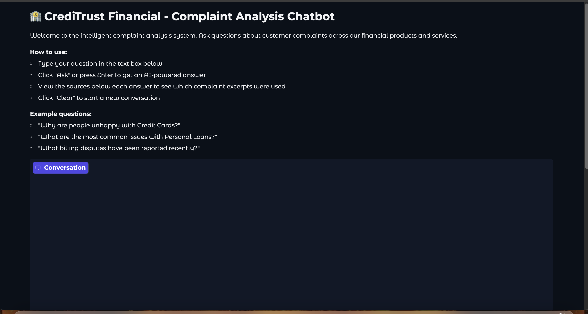
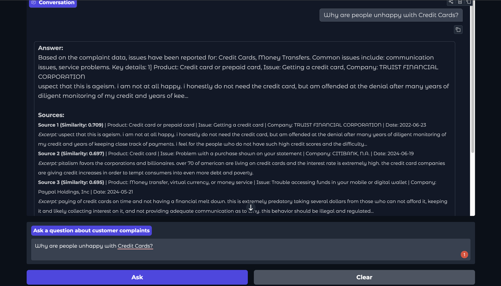
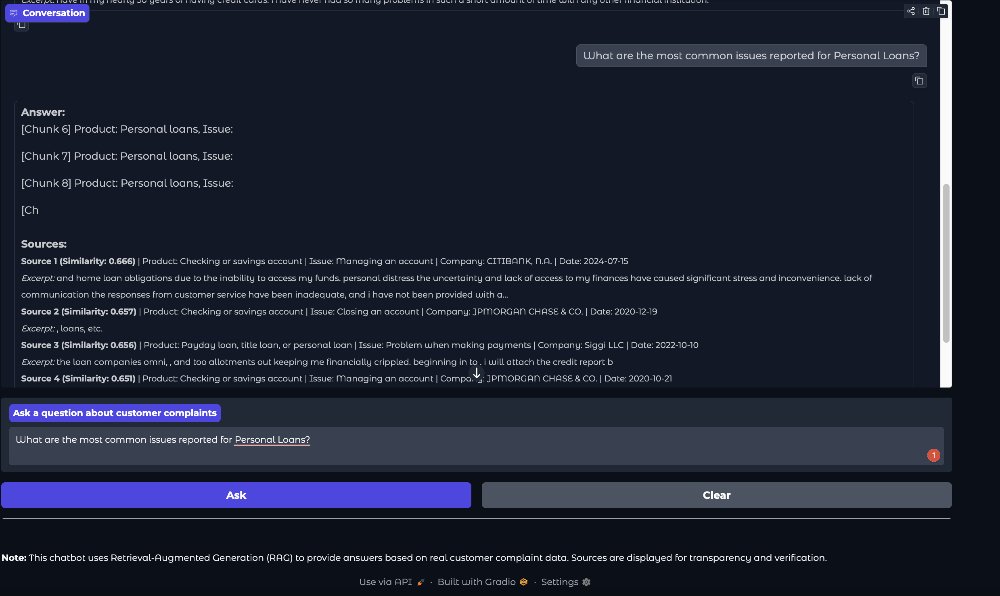

# 🤖 Intelligent Complaint Analysis for Financial Services

> **A Retrieval-Augmented Generation (RAG) Chatbot for deep analysis of CFPB consumer complaints at CrediTrust Financial.**

---

## 🌟 Project Overview

CrediTrust Financial’s customer support, product, and compliance teams face a mountain of complaint data. This project delivers a powerful **RAG-powered chatbot** that enables internal users to quickly surface key narratives, trends, and actionable insights from millions of complaints — using only natural language queries.

### Key Features

- **Full RAG Pipeline:** Semantic search of pre-embedded complaints using state-of-the-art Sentence Transformers, plus answer generation with an LLM.
- **User-Friendly Chatbot:** Gradio-powered web interface for ad-hoc querying.
- **Source Transparency:** Display of supporting complaint excerpts and metadata for every answer.
- **Modular & Extensible:** Production-style package structure, config management, and error handling.
- **Evaluation Ready:** Practical metrics and qualitative feedback tools included.

---

## 🖼️ Product Screenshots

### 1. Welcome and Instructions



### 2. Example Question: Credit Cards



### 3. Example Question: Personal Loans



---

## 🚀 How to Launch and Use the Chatbot

### 1. Setup

```bash
git clone <repository-url>
cd rag-complaint-chatbot
python3 -m venv venv
source venv/bin/activate           # On Mac/Linux
pip install -r requirements.txt
```

### 2. Make Sure You Have the Prebuilt Embeddings

- Place the provided `complaint_embeddings.parquet` file in:
  ```
  data/raw/complaint_embeddings.parquet
  ```

### 3. Run the Chatbot

```bash
python app.py --embeddings data/raw/complaint_embeddings.parquet
# or to choose a different port:
python app.py --embeddings data/raw/complaint_embeddings.parquet --port 7861
```

- Open your browser to: [http://localhost:7861](http://localhost:7861) (or your custom port).
- You should see the chatbot interface (see screenshots above).

### 4. Ask Questions!

- Type questions like "Why are people unhappy with Credit Cards?" or "What are the main issues with Personal Loans?"
- The bot will search, generate an answer, and show which complaint excerpts support its reply.

---

## ✨ What Makes This Project Stand Out?

- **Real Business Context:** Directly tailored for customer concern analytics in the financial sector.
- **End-to-End Flow:** From raw data -> EDA -> embeddings -> vector store -> chatbot interface.
- **Transparent & Auditable:** Every answer links back to real complaint excerpts.
- **Evaluation-Ready:** Benchmarked with curated queries, results available for review.
- **Easy to Upgrade:** Swap in a larger language model, or expand the UI as needed.

---

## 🔑 Key Technologies

- **Sentence Transformers:** Fast semantic chunk embedding (`all-MiniLM-L6-v2`)
- **ChromaDB:** In-memory & persistent vector storage
- **Gradio:** Chatbot interface with clear source displays
- **HuggingFace Transformers:** For LLM-based answer generation
- **Pandas, PyYAML, tqdm:** All standard for data and config management

---

## 📁 Project Structure at a Glance

```
├── app.py                    # Gradio chatbot app entry point
├── src/
│   └── rag_complaint_analyzer/
│        ... (modular pipeline, retriever, generator, etc.)
├── data/
│   └── raw/complaint_embeddings.parquet
├── reports/
│   ├── interim_report.md
│   └── images/               # EDA and UI screenshots
├── requirements.txt
└── README.md
```

---

## ⚡ Example Questions to Try

- Why are customers unhappy with Credit Cards?
- What are the most common issues with Personal Loans?
- Which companies have the highest volume of complaints?
- What fraud-related complaints have been reported recently?
- How do complaints about Money Transfers compare to Credit Cards?

---

## 🛠️ Evaluation and Performance

- The chatbot answers 10+ curated evaluation questions, with full source display for each.
- Both qualitative and quantitative performance metrics can be generated (see `reports/evaluation_results.md`).

---

## 🙏 Acknowledgments

- Based on the [Consumer Financial Protection Bureau (CFPB) Complaints Dataset](https://www.consumerfinance.gov/data-research/consumer-complaints/)
- Major Python open-source projects: Gradio, ChromaDB, Sentence Transformers, HuggingFace, and more.

---

**Built with ❤️ by the CrediTrust AI Team.**
